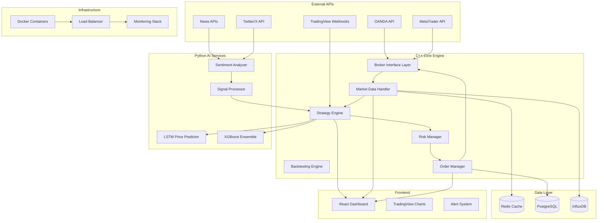

# Forex Scalping Bot - Comprehensive Architecture Plan

## System Overview

This high-performance Forex scalping bot will be built with a modular, microservices architecture designed for low-latency trading, real-time data processing, and AI-driven decision making.

## Architecture Components



## Project Structure

```
forex-scalping-bot/
├── cpp/                           # C++ Core Engine
│   ├── src/
│   │   ├── core/                  # Core trading engine
│   │   ├── brokers/               # Broker API implementations
│   │   ├── strategies/            # Trading strategies
│   │   ├── risk/                  # Risk management
│   │   ├── backtest/              # Backtesting engine
│   │   └── utils/                 # Utilities and helpers
│   ├── include/                   # Header files
│   ├── tests/                     # Unit tests
│   └── CMakeLists.txt
├── python/                        # AI Microservices
│   ├── price_predictor/           # LSTM/XGBoost services
│   ├── sentiment_analyzer/        # News/social sentiment
│   ├── signal_processor/          # Signal aggregation
│   └── requirements.txt
├── frontend/                      # React Dashboard
│   ├── src/
│   ├── public/
│   ├── package.json
│   └── webpack.config.js
├── config/                        # Configuration files
├── docker/                        # Docker configurations
├── scripts/                       # Deployment scripts
├── docs/                          # Documentation
└── docker-compose.yml
```

## Core C++ Engine Architecture

### 1. Broker Interface Layer
- **Abstract base class** for broker implementations
- **OANDA REST/WebSocket** client with rate limiting
- **MetaTrader bridge** via DLL/COM interface
- **Connection pooling** and failover mechanisms
- **Authentication management** with token refresh

### 2. Market Data Handler
- **Real-time tick data** processing
- **OHLCV bar construction** with multiple timeframes
- **Data validation** and gap detection
- **Latency measurement** and compensation
- **Historical data** loading and caching

### 3. Strategy Engine
- **Momentum EMA Crossover** with MACD filtering
- **Mean Reversion** using RSI and Bollinger Bands
- **ATR Breakout Detection** from price extremes
- **Multi-timeframe analysis** capabilities
- **Signal aggregation** from AI services

### 4. Risk Management System
- **Dynamic ATR-based** stop-losses
- **Kelly Criterion** position sizing
- **Maximum daily drawdown** protection
- **Correlation-based exposure** limits
- **Portfolio-level coordination**

### 5. Backtesting Engine
- **1-minute OHLCV** data processing
- **Realistic slippage** simulation
- **Performance metrics** (Sharpe, max drawdown)
- **Trade logging** and analysis
- **Parameter optimization** with genetic algorithms

## Python AI Services

### 1. Price Prediction Service
- **LSTM neural networks** for time series forecasting
- **XGBoost ensemble** methods for feature-based prediction
- **Feature engineering** from technical indicators
- **Model training** and real-time inference
- **RESTful API** endpoints for C++ integration

### 2. Sentiment Analysis Service
- **Twitter/X feed** processing with streaming API
- **Financial news** aggregation and analysis
- **VADER sentiment** analysis
- **Fine-tuned BERT** models for financial text
- **Real-time sentiment** scoring and alerts

## React Dashboard Features

### 1. Real-time Visualization
- **WebSocket streaming** for live updates
- **TradingView charts** with custom indicators
- **Live P&L tracking** with drill-down capabilities
- **Position monitoring** and risk metrics
- **Performance analytics** dashboard

### 2. Control Interface
- **Strategy configuration** and parameter tuning
- **Manual trading** controls
- **Risk limit** adjustments
- **System monitoring** and health checks
- **Alert management** interface

## Technical Specifications

### Performance Requirements
- **Sub-millisecond latency** for order execution
- **1000+ ticks/second** data processing capability
- **99.9% uptime** with automatic failover
- **Real-time risk** monitoring and circuit breakers

### Data Management
- **Redis** for high-speed caching and pub/sub
- **PostgreSQL** for trade history and configuration
- **InfluxDB** for time-series market data
- **Automated backup** and disaster recovery

### Security & Compliance
- **API key encryption** and secure storage
- **Trade audit** logging for compliance
- **Rate limiting** and DDoS protection
- **SSL/TLS encryption** for all communications

## Deployment Architecture

### Docker Containerization
- **Multi-stage builds** for optimized images
- **Container orchestration** with Docker Compose
- **Health checks** and automatic restarts
- **Resource limits** and monitoring

### Production Infrastructure
- **VPS deployment** with systemd management
- **Load balancing** with NGINX
- **Monitoring stack** (Prometheus/Grafana)
- **Telegram notifications** for critical events

## Development Phases

The project will be implemented in phases:

1. **Phase 1**: Core C++ engine and basic strategies
2. **Phase 2**: Broker integrations and market data
3. **Phase 3**: Risk management and backtesting
4. **Phase 4**: Python AI services integration
5. **Phase 5**: React dashboard and visualization
6. **Phase 6**: Production deployment and monitoring

Each phase includes comprehensive testing, documentation, and performance optimization.

## Key Features Summary

- **High-frequency scalping** with sub-millisecond execution
- **AI-driven predictions** using LSTM and XGBoost
- **Real-time sentiment analysis** from news and social media
- **Advanced risk management** with dynamic position sizing
- **Comprehensive backtesting** with realistic simulation
- **Professional dashboard** with real-time visualization
- **Production-ready deployment** with monitoring and alerts
- **Multi-broker support** (OANDA, MetaTrader)
- **Horizontal scaling** for multiple currency pairs
- **Paper trading mode** for safe testing

This architecture provides a solid foundation for a production-ready Forex scalping bot that can handle high-frequency trading while maintaining reliability, scalability, and extensibility.