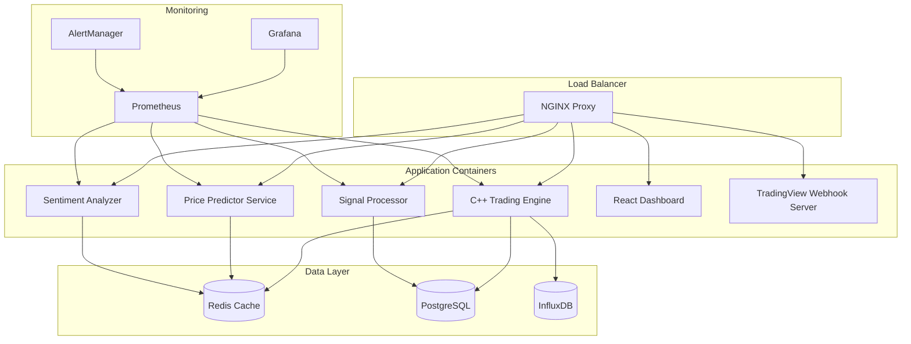

# Deployment & Infrastructure Specifications

## Overview

This document outlines the complete deployment strategy for the Forex Scalping Bot, including Docker containerization, production infrastructure, monitoring, and CI/CD pipeline.

## Docker Architecture



## Docker Compose Configuration

### Production Docker Compose (docker-compose.prod.yml)

```yaml
version: '3.8'

services:
  # NGINX Load Balancer
  nginx:
    build:
      context: ./docker/nginx
      dockerfile: Dockerfile
    ports:
      - "80:80"
      - "443:443"
    volumes:
      - ./docker/nginx/nginx.conf:/etc/nginx/nginx.conf
      - ./ssl:/etc/nginx/ssl
    depends_on:
      - cpp-engine
      - react-dashboard
      - price-predictor
      - sentiment-analyzer
    networks:
      - forex-network
    restart: unless-stopped

  # C++ Trading Engine
  cpp-engine:
    build:
      context: ./cpp
      dockerfile: Dockerfile
      target: production
    environment:
      - ENVIRONMENT=production
      - LOG_LEVEL=info
      - REDIS_HOST=redis
      - POSTGRES_HOST=postgres
      - INFLUX_HOST=influxdb
    volumes:
      - ./config:/app/config:ro
      - ./logs:/app/logs
      - ./data:/app/data
    depends_on:
      - redis
      - postgres
      - influxdb
    networks:
      - forex-network
    restart: unless-stopped
    deploy:
      resources:
        limits:
          cpus: '2.0'
          memory: 4G
        reservations:
          cpus: '1.0'
          memory: 2G

  # Price Predictor Service
  price-predictor:
    build:
      context: ./python/price_predictor
      dockerfile: Dockerfile
    environment:
      - FLASK_ENV=production
      - REDIS_HOST=redis
      - POSTGRES_HOST=postgres
      - MODEL_PATH=/app/models
    volumes:
      - ./python/price_predictor/models:/app/models
      - ./logs:/app/logs
    depends_on:
      - redis
      - postgres
    networks:
      - forex-network
    restart: unless-stopped
    deploy:
      resources:
        limits:
          cpus: '1.0'
          memory: 2G

  # Sentiment Analyzer Service
  sentiment-analyzer:
    build:
      context: ./python/sentiment_analyzer
      dockerfile: Dockerfile
    environment:
      - FLASK_ENV=production
      - REDIS_HOST=redis
      - TWITTER_API_KEY=${TWITTER_API_KEY}
      - NEWS_API_KEY=${NEWS_API_KEY}
    volumes:
      - ./python/sentiment_analyzer/models:/app/models
      - ./logs:/app/logs
    depends_on:
      - redis
    networks:
      - forex-network
    restart: unless-stopped

  # Signal Processor Service
  signal-processor:
    build:
      context: ./python/signal_processor
      dockerfile: Dockerfile
    environment:
      - FLASK_ENV=production
      - REDIS_HOST=redis
      - POSTGRES_HOST=postgres
    depends_on:
      - redis
      - postgres
    networks:
      - forex-network
    restart: unless-stopped

  # React Dashboard
  react-dashboard:
    build:
      context: ./frontend
      dockerfile: Dockerfile
      target: production
    environment:
      - NODE_ENV=production
      - REACT_APP_API_URL=https://your-domain.com/api
      - REACT_APP_WS_URL=wss://your-domain.com/ws
    networks:
      - forex-network
    restart: unless-stopped

  # TradingView Webhook Server
  tradingview-webhook:
    build:
      context: ./webhook
      dockerfile: Dockerfile
    environment:
      - ENVIRONMENT=production
      - WEBHOOK_SECRET=${WEBHOOK_SECRET}
      - CPP_ENGINE_URL=http://cpp-engine:8080
    networks:
      - forex-network
    restart: unless-stopped

  # Redis Cache
  redis:
    image: redis:7-alpine
    command: redis-server --appendonly yes --requirepass ${REDIS_PASSWORD}
    volumes:
      - redis-data:/data
    networks:
      - forex-network
    restart: unless-stopped
    deploy:
      resources:
        limits:
          memory: 1G

  # PostgreSQL Database
  postgres:
    image: postgres:15-alpine
    environment:
      - POSTGRES_DB=forex_bot
      - POSTGRES_USER=${POSTGRES_USER}
      - POSTGRES_PASSWORD=${POSTGRES_PASSWORD}
    volumes:
      - postgres-data:/var/lib/postgresql/data
      - ./database/init.sql:/docker-entrypoint-initdb.d/init.sql
    networks:
      - forex-network
    restart: unless-stopped
    deploy:
      resources:
        limits:
          memory: 2G

  # InfluxDB Time Series Database
  influxdb:
    image: influxdb:2.7-alpine
    environment:
      - INFLUXDB_DB=market_data
      - INFLUXDB_ADMIN_USER=${INFLUX_USER}
      - INFLUXDB_ADMIN_PASSWORD=${INFLUX_PASSWORD}
    volumes:
      - influx-data:/var/lib/influxdb2
    networks:
      - forex-network
    restart: unless-stopped

  # Prometheus Monitoring
  prometheus:
    image: prom/prometheus:latest
    command:
      - '--config.file=/etc/prometheus/prometheus.yml'
      - '--storage.tsdb.path=/prometheus'
      - '--web.console.libraries=/etc/prometheus/console_libraries'
      - '--web.console.templates=/etc/prometheus/consoles'
      - '--storage.tsdb.retention.time=200h'
      - '--web.enable-lifecycle'
    volumes:
      - ./monitoring/prometheus.yml:/etc/prometheus/prometheus.yml
      - prometheus-data:/prometheus
    networks:
      - forex-network
    restart: unless-stopped

  # Grafana Dashboard
  grafana:
    image: grafana/grafana:latest
    environment:
      - GF_SECURITY_ADMIN_USER=${GRAFANA_USER}
      - GF_SECURITY_ADMIN_PASSWORD=${GRAFANA_PASSWORD}
      - GF_USERS_ALLOW_SIGN_UP=false
    volumes:
      - grafana-data:/var/lib/grafana
      - ./monitoring/grafana/dashboards:/etc/grafana/provisioning/dashboards
      - ./monitoring/grafana/datasources:/etc/grafana/provisioning/datasources
    networks:
      - forex-network
    restart: unless-stopped

  # AlertManager
  alertmanager:
    image: prom/alertmanager:latest
    command:
      - '--config.file=/etc/alertmanager/config.yml'
      - '--storage.path=/alertmanager'
    volumes:
      - ./monitoring/alertmanager.yml:/etc/alertmanager/config.yml
      - alertmanager-data:/alertmanager
    networks:
      - forex-network
    restart: unless-stopped

volumes:
  redis-data:
  postgres-data:
  influx-data:
  prometheus-data:
  grafana-data:
  alertmanager-data:

networks:
  forex-network:
    driver: bridge
```

## Dockerfile Specifications

### C++ Trading Engine Dockerfile

```dockerfile
# Multi-stage build for C++ application
FROM ubuntu:22.04 as builder

# Install build dependencies
RUN apt-get update && apt-get install -y \
    build-essential \
    cmake \
    git \
    libboost-all-dev \
    libssl-dev \
    libcurl4-openssl-dev \
    nlohmann-json3-dev \
    libspdlog-dev \
    libhiredis-dev \
    libpq-dev \
    pkg-config \
    && rm -rf /var/lib/apt/lists/*

# Set working directory
WORKDIR /app

# Copy source code
COPY . .

# Build application
RUN mkdir build && cd build && \
    cmake -DCMAKE_BUILD_TYPE=Release .. && \
    make -j$(nproc)

# Production stage
FROM ubuntu:22.04 as production

# Install runtime dependencies
RUN apt-get update && apt-get install -y \
    libboost-system1.74.0 \
    libboost-thread1.74.0 \
    libboost-chrono1.74.0 \
    libssl3 \
    libcurl4 \
    libhiredis0.14 \
    libpq5 \
    && rm -rf /var/lib/apt/lists/*

# Create app user
RUN useradd -m -u 1000 appuser

# Set working directory
WORKDIR /app

# Copy built application
COPY --from=builder /app/build/ForexScalpingBot /app/
COPY --from=builder /app/config /app/config

# Set ownership
RUN chown -R appuser:appuser /app

# Switch to app user
USER appuser

# Expose port
EXPOSE 8080

# Health check
HEALTHCHECK --interval=30s --timeout=10s --start-period=5s --retries=3 \
    CMD curl -f http://localhost:8080/health || exit 1

# Start application
CMD ["./ForexScalpingBot"]
```

### Python Service Dockerfile

```dockerfile
FROM python:3.11-slim as base

# Set environment variables
ENV PYTHONDONTWRITEBYTECODE=1 \
    PYTHONUNBUFFERED=1 \
    PIP_NO_CACHE_DIR=1 \
    PIP_DISABLE_PIP_VERSION_CHECK=1

# Install system dependencies
RUN apt-get update && apt-get install -y \
    gcc \
    g++ \
    && rm -rf /var/lib/apt/lists/*

# Create app user
RUN useradd -m -u 1000 appuser

# Set working directory
WORKDIR /app

# Copy requirements
COPY requirements.txt .

# Install Python dependencies
RUN pip install --no-cache-dir -r requirements.txt

# Copy application code
COPY . .

# Set ownership
RUN chown -R appuser:appuser /app

# Switch to app user
USER appuser

# Expose port
EXPOSE 5000

# Health check
HEALTHCHECK --interval=30s --timeout=10s --start-period=5s --retries=3 \
    CMD curl -f http://localhost:5000/health || exit 1

# Start application
CMD ["gunicorn", "--bind", "0.0.0.0:5000", "--workers", "4", "app:app"]
```

### React Dashboard Dockerfile

```dockerfile
# Build stage
FROM node:18-alpine as builder

WORKDIR /app

# Copy package files
COPY package*.json ./

# Install dependencies
RUN npm ci --only=production

# Copy source code
COPY . .

# Build application
RUN npm run build

# Production stage
FROM nginx:alpine as production

# Copy built application
COPY --from=builder /app/build /usr/share/nginx/html

# Copy nginx configuration
COPY nginx.conf /etc/nginx/conf.d/default.conf

# Expose port
EXPOSE 80

# Health check
HEALTHCHECK --interval=30s --timeout=10s --start-period=5s --retries=3 \
    CMD curl -f http://localhost/health || exit 1

# Start nginx
CMD ["nginx", "-g", "daemon off;"]
```

## Production Infrastructure

### VPS Requirements

**Minimum Specifications:**
- **CPU:** 8 cores (3.0GHz+)
- **RAM:** 32GB
- **Storage:** 500GB NVMe SSD
- **Network:** 1Gbps connection
- **OS:** Ubuntu 22.04 LTS

**Recommended Specifications:**
- **CPU:** 16 cores (3.5GHz+)
- **RAM:** 64GB
- **Storage:** 1TB NVMe SSD
- **Network:** 10Gbps connection
- **Backup:** Automated daily backups

### System Configuration

#### Systemd Service Configuration

```ini
# /etc/systemd/system/forex-bot.service
[Unit]
Description=Forex Scalping Bot
After=docker.service
Requires=docker.service

[Service]
Type=oneshot
RemainAfterExit=yes
WorkingDirectory=/opt/forex-scalping-bot
ExecStart=/usr/bin/docker-compose -f docker-compose.prod.yml up -d
ExecStop=/usr/bin/docker-compose -f docker-compose.prod.yml down
TimeoutStartSec=0

[Install]
WantedBy=multi-user.target
```

#### NGINX Configuration

```nginx
# /etc/nginx/sites-available/forex-bot
upstream cpp_backend {
    server cpp-engine:8080;
    keepalive 32;
}

upstream python_services {
    server price-predictor:5001;
    server sentiment-analyzer:5002;
    server signal-processor:5003;
}

upstream react_frontend {
    server react-dashboard:80;
}

# Rate limiting
limit_req_zone $binary_remote_addr zone=api:10m rate=100r/m;
limit_req_zone $binary_remote_addr zone=ws:10m rate=10r/s;

server {
    listen 80;
    server_name your-domain.com;
    return 301 https://$server_name$request_uri;
}

server {
    listen 443 ssl http2;
    server_name your-domain.com;

    # SSL Configuration
    ssl_certificate /etc/nginx/ssl/cert.pem;
    ssl_certificate_key /etc/nginx/ssl/key.pem;
    ssl_protocols TLSv1.2 TLSv1.3;
    ssl_ciphers ECDHE-RSA-AES256-GCM-SHA512:DHE-RSA-AES256-GCM-SHA512;
    ssl_prefer_server_ciphers off;

    # Security Headers
    add_header X-Frame-Options DENY;
    add_header X-Content-Type-Options nosniff;
    add_header X-XSS-Protection "1; mode=block";
    add_header Strict-Transport-Security "max-age=63072000; includeSubDomains; preload";

    # Frontend
    location / {
        proxy_pass http://react_frontend;
        proxy_set_header Host $host;
        proxy_set_header X-Real-IP $remote_addr;
        proxy_set_header X-Forwarded-For $proxy_add_x_forwarded_for;
        proxy_set_header X-Forwarded-Proto $scheme;
    }

    # API Routes
    location /api/ {
        limit_req zone=api burst=20 nodelay;
        proxy_pass http://cpp_backend;
        proxy_set_header Host $host;
        proxy_set_header X-Real-IP $remote_addr;
        proxy_set_header X-Forwarded-For $proxy_add_x_forwarded_for;
        proxy_set_header X-Forwarded-Proto $scheme;
        proxy_connect_timeout 5s;
        proxy_send_timeout 10s;
        proxy_read_timeout 10s;
    }

    # WebSocket
    location /ws {
        limit_req zone=ws burst=5 nodelay;
        proxy_pass http://cpp_backend;
        proxy_http_version 1.1;
        proxy_set_header Upgrade $http_upgrade;
        proxy_set_header Connection "upgrade";
        proxy_set_header Host $host;
        proxy_set_header X-Real-IP $remote_addr;
        proxy_set_header X-Forwarded-For $proxy_add_x_forwarded_for;
        proxy_set_header X-Forwarded-Proto $scheme;
        proxy_read_timeout 86400;
    }

    # Python AI Services
    location /ai/ {
        limit_req zone=api burst=10 nodelay;
        proxy_pass http://python_services;
        proxy_set_header Host $host;
        proxy_set_header X-Real-IP $remote_addr;
        proxy_set_header X-Forwarded-For $proxy_add_x_forwarded_for;
        proxy_set_header X-Forwarded-Proto $scheme;
    }

    # Health Check
    location /health {
        access_log off;
        return 200 "healthy\n";
        add_header Content-Type text/plain;
    }
}
```

## Monitoring & Alerting

### Prometheus Configuration

```yaml
# monitoring/prometheus.yml
global:
  scrape_interval: 15s
  evaluation_interval: 15s

rule_files:
  - "alert_rules.yml"

alerting:
  alertmanagers:
    - static_configs:
        - targets:
          - alertmanager:9093

scrape_configs:
  - job_name: 'cpp-engine'
    static_configs:
      - targets: ['cpp-engine:8080']
    metrics_path: '/metrics'
    scrape_interval: 5s

  - job_name: 'python-services'
    static_configs:
      - targets: 
        - 'price-predictor:5001'
        - 'sentiment-analyzer:5002'
        - 'signal-processor:5003'
    metrics_path: '/metrics'
    scrape_interval: 15s

  - job_name: 'redis'
    static_configs:
      - targets: ['redis:6379']

  - job_name: 'postgres'
    static_configs:
      - targets: ['postgres:5432']

  - job_name: 'node-exporter'
    static_configs:
      - targets: ['node-exporter:9100']
```

### Alert Rules

```yaml
# monitoring/alert_rules.yml
groups:
  - name: trading_alerts
    rules:
      - alert: HighDrawdown
        expr: trading_daily_drawdown > 0.05
        for: 1m
        labels:
          severity: critical
        annotations:
          summary: "High daily drawdown detected"
          description: "Daily drawdown is {{ $value }}%, exceeding 5% limit"

      - alert: TradingEngineDown
        expr: up{job="cpp-engine"} == 0
        for: 30s
        labels:
          severity: critical
        annotations:
          summary: "Trading engine is down"
          description: "C++ trading engine has been down for more than 30 seconds"

      - alert: HighLatency
        expr: trading_order_latency_ms > 100
        for: 2m
        labels:
          severity: warning
        annotations:
          summary: "High order execution latency"
          description: "Order execution latency is {{ $value }}ms"

      - alert: DatabaseConnectionLoss
        expr: up{job="postgres"} == 0
        for: 1m
        labels:
          severity: critical
        annotations:
          summary: "Database connection lost"
          description: "PostgreSQL database is unreachable"

      - alert: RedisConnectionLoss
        expr: up{job="redis"} == 0
        for: 1m
        labels:
          severity: critical
        annotations:
          summary: "Redis connection lost"
          description: "Redis cache is unreachable"

      - alert: HighMemoryUsage
        expr: (node_memory_MemTotal_bytes - node_memory_MemAvailable_bytes) / node_memory_MemTotal_bytes > 0.9
        for: 5m
        labels:
          severity: warning
        annotations:
          summary: "High memory usage"
          description: "Memory usage is above 90%"

      - alert: HighCPUUsage
        expr: 100 - (avg by(instance) (irate(node_cpu_seconds_total{mode="idle"}[5m])) * 100) > 80
        for: 5m
        labels:
          severity: warning
        annotations:
          summary: "High CPU usage"
          description: "CPU usage is above 80%"
```

### AlertManager Configuration

```yaml
# monitoring/alertmanager.yml
global:
  smtp_smarthost: 'localhost:587'
  smtp_from: 'alerts@your-domain.com'

route:
  group_by: ['alertname']
  group_wait: 10s
  group_interval: 10s
  repeat_interval: 1h
  receiver: 'telegram-notifications'

receivers:
  - name: 'telegram-notifications'
    telegram_configs:
      - bot_token: '${TELEGRAM_BOT_TOKEN}'
        chat_id: ${TELEGRAM_CHAT_ID}
        title: 'Forex Bot Alert'
        message: |
          {{ range .Alerts }}
          Alert: {{ .Annotations.summary }}
          Description: {{ .Annotations.description }}
          Severity: {{ .Labels.severity }}
          {{ end }}

  - name: 'email-notifications'
    email_configs:
      - to: 'admin@your-domain.com'
        subject: 'Forex Bot Alert: {{ .GroupLabels.alertname }}'
        body: |
          {{ range .Alerts }}
          Alert: {{ .Annotations.summary }}
          Description: {{ .Annotations.description }}
          Severity: {{ .Labels.severity }}
          Time: {{ .StartsAt }}
          {{ end }}

inhibit_rules:
  - source_match:
      severity: 'critical'
    target_match:
      severity: 'warning'
    equal: ['alertname', 'instance']
```

## Deployment Scripts

### Build Script

```bash
#!/bin/bash
# scripts/build.sh

set -e

echo "Building Forex Scalping Bot..."

# Build C++ application
echo "Building C++ trading engine..."
cd cpp
mkdir -p build
cd build
cmake -DCMAKE_BUILD_TYPE=Release ..
make -j$(nproc)
cd ../..

# Build Python services
echo "Building Python services..."
for service in price_predictor sentiment_analyzer signal_processor; do
    echo "Building $service..."
    cd python/$service
    pip install -r requirements.txt
    cd ../..
done

# Build React dashboard
echo "Building React dashboard..."
cd frontend
npm install
npm run build
cd ..

# Build Docker images
echo "Building Docker images..."
docker-compose -f docker-compose.prod.yml build

echo "Build completed successfully!"
```

### Deployment Script

```bash
#!/bin/bash
# scripts/deploy.sh

set -e

echo "Deploying Forex Scalping Bot..."

# Load environment variables
if [ -f .env.prod ]; then
    export $(cat .env.prod | xargs)
fi

# Create necessary directories
sudo mkdir -p /opt/forex-scalping-bot
sudo mkdir -p /var/log/forex-bot
sudo mkdir -p /var/lib/forex-bot

# Copy application files
sudo cp -r . /opt/forex-scalping-bot/
sudo chown -R $USER:$USER /opt/forex-scalping-bot

# Set up SSL certificates (Let's Encrypt)
if [ ! -f /etc/nginx/ssl/cert.pem ]; then
    echo "Setting up SSL certificates..."
    sudo certbot certonly --standalone -d your-domain.com
    sudo cp /etc/letsencrypt/live/your-domain.com/fullchain.pem /etc/nginx/ssl/cert.pem
    sudo cp /etc/letsencrypt/live/your-domain.com/privkey.pem /etc/nginx/ssl/key.pem
fi

# Deploy with Docker Compose
cd /opt/forex-scalping-bot
docker-compose -f docker-compose.prod.yml down
docker-compose -f docker-compose.prod.yml up -d

# Install and enable systemd service
sudo cp scripts/forex-bot.service /etc/systemd/system/
sudo systemctl daemon-reload
sudo systemctl enable forex-bot
sudo systemctl start forex-bot

# Set up log rotation
sudo cp scripts/logrotate.conf /etc/logrotate.d/forex-bot

# Set up backup cron job
(crontab -l 2>/dev/null; echo "0 2 * * * /opt/forex-scalping-bot/scripts/backup.sh") | crontab -

echo "Deployment completed successfully!"
echo "Dashboard available at: https://your-domain.com"
echo "Monitoring available at: https://your-domain.com:3000"
```

### Backup Script

```bash
#!/bin/bash
# scripts/backup.sh

set -e

BACKUP_DIR="/var/backups/forex-bot"
DATE=$(date +%Y%m%d_%H%M%S)

echo "Starting backup process..."

# Create backup directory
mkdir -p $BACKUP_DIR

# Backup PostgreSQL database
docker exec postgres pg_dump -U $POSTGRES_USER forex_bot | gzip > $BACKUP_DIR/postgres_$DATE.sql.gz

# Backup Redis data
docker exec redis redis-cli --rdb /data/dump.rdb
docker cp redis:/data/dump.rdb $BACKUP_DIR/redis_$DATE.rdb

# Backup InfluxDB data
docker exec influxdb influx backup /tmp/backup
docker cp influxdb:/tmp/backup $BACKUP_DIR/influx_$DATE/

# Backup configuration files
tar -czf $BACKUP_DIR/config_$DATE.tar.gz config/

# Backup logs
tar -czf $BACKUP_DIR/logs_$DATE.tar.gz logs/

# Clean up old backups (keep last 7 days)
find $BACKUP_DIR -name "*.gz" -mtime +7 -delete
find $BACKUP_DIR -name "*.rdb" -mtime +7 -delete
find $BACKUP_DIR -type d -name "influx_*" -mtime +7 -exec rm -rf {} +

echo "Backup completed successfully!"
```

## Environment Configuration

### Production Environment Variables (.env.prod)

```bash
# Database Configuration
POSTGRES_USER=forex_user
POSTGRES_PASSWORD=secure_password_here
POSTGRES_DB=forex_bot

# Redis Configuration
REDIS_PASSWORD=redis_password_here

# InfluxDB Configuration
INFLUX_USER=influx_user
INFLUX_PASSWORD=influx_password_here

# API Keys
OANDA_API_KEY=your_oanda_api_key
OANDA_ACCOUNT_ID=your_oanda_account_id
TWITTER_API_KEY=your_twitter_api_key
NEWS_API_KEY=your_news_api_key

# Security
WEBHOOK_SECRET=webhook_secret_key
JWT_SECRET=jwt_secret_key

# Monitoring
GRAFANA_USER=admin
GRAFANA_PASSWORD=grafana_password
TELEGRAM_BOT_TOKEN=your_telegram_bot_token
TELEGRAM_CHAT_ID=your_telegram_chat_id

# Application Settings
ENVIRONMENT=production
LOG_LEVEL=info
DEBUG=false
```

This comprehensive deployment specification provides everything needed to deploy the Forex Scalping Bot in a production environment with proper monitoring, alerting, and backup strategies.