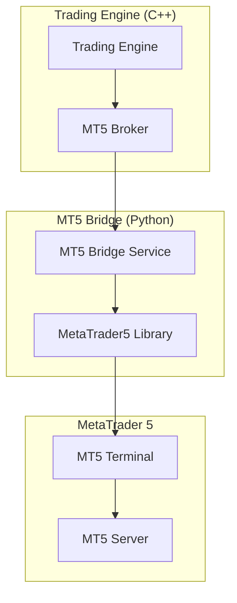

# MetaTrader 5 Integration Guide

## Overview

This guide explains how to integrate and use MetaTrader 5 (MT5) with the Forex Scalping Bot. The integration provides real-time market data, order execution, and account management through the MT5 platform.

## Architecture

The MT5 integration consists of two main components:

1. **Python MT5 Bridge Service** - Interfaces with the MetaTrader5 Python library
2. **C++ MT5Broker Implementation** - Provides a unified interface for the trading engine



## Prerequisites

### MetaTrader 5 Setup

1. **Install MetaTrader 5**
   - Download from [MetaQuotes official website](https://www.metatrader5.com/)
   - Install on Windows (required for MetaTrader5 Python library)

2. **Open Trading Account**
   - Register with an MT5 broker
   - Obtain login credentials (login, password, server)

3. **Enable Algorithmic Trading**
   - In MT5 Terminal: Tools → Options → Expert Advisors
   - Check "Allow algorithmic trading"
   - Check "Allow DLL imports"

### Python Dependencies

Install the required Python packages:

```bash
pip install MetaTrader5 pandas numpy flask requests python-dotenv
```

### Environment Variables

Set the following environment variables:

```bash
# MT5 Account Credentials
export MT5_LOGIN=your_account_number
export MT5_PASSWORD=your_password
export MT5_SERVER=your_broker_server

# Optional: MT5 Installation Path
export MT5_PATH="C:\Program Files\MetaTrader 5\terminal64.exe"

# Bridge Configuration
export MT5_BRIDGE_HOST=0.0.0.0
export MT5_BRIDGE_PORT=5000
```

## Configuration

### 1. Update Trading Configuration

Edit `config/trading_config.json`:

```json
{
  "broker": {
    "type": "mt5",
    "mt5": {
      "login": "${MT5_LOGIN}",
      "password": "${MT5_PASSWORD}",
      "server": "${MT5_SERVER}",
      "path": "${MT5_PATH}",
      "bridge_url": "http://localhost:5004",
      "magic_number": 12345
    }
  }
}
```

### 2. MT5-Specific Configuration

The `config/mt5_config.json` file contains MT5-specific settings:

```json
{
  "mt5": {
    "login": "${MT5_LOGIN}",
    "password": "${MT5_PASSWORD}",
    "server": "${MT5_SERVER}",
    "bridge_port": 5000
  },
  "symbols": [
    "EURUSD", "GBPUSD", "USDJPY", "AUDUSD", "USDCHF"
  ],
  "trading": {
    "magic_number": 12345,
    "slippage": 3,
    "max_spread": 5,
    "min_lot_size": 0.01,
    "max_lot_size": 10.0
  }
}
```

## Running the System

### Using Docker Compose

1. **Start all services:**
```bash
docker-compose up -d
```

2. **Check MT5 bridge status:**
```bash
curl http://localhost:5004/health
```

### Manual Setup

1. **Start MT5 Bridge:**
```bash
cd python/mt5_bridge
python mt5_bridge.py
```

2. **Start Trading Engine:**
```bash
cd cpp/build
./ForexScalpingBot
```

## API Reference

### MT5 Bridge Endpoints

#### Health Check
```http
GET /health
```
Returns the health status of the MT5 bridge service.

#### Connect to MT5
```http
POST /connect
Content-Type: application/json

{
  "login": 123456789,
  "password": "your_password",
  "server": "broker_server"
}
```

#### Get Account Information
```http
GET /account_info
```
Returns MT5 account details including balance, equity, and margin.

#### Get Market Data
```http
GET /market_data/{symbol}
```
Returns current tick data for the specified symbol.

#### Get Historical Data
```http
GET /historical_data/{symbol}?timeframe=M1&count=1000
```
Returns historical OHLCV data for the symbol.

#### Place Order
```http
POST /place_order
Content-Type: application/json

{
  "symbol": "EURUSD",
  "order_type": "buy",
  "volume": 0.1,
  "price": 1.1000,
  "sl": 1.0950,
  "tp": 1.1050,
  "comment": "Bot Order"
}
```

#### Get Positions
```http
GET /positions
```
Returns all open positions.

#### Get Orders
```http
GET /orders
```
Returns all pending orders.

## Symbol Mapping

The system automatically converts between standard format and MT5 format:

| Standard Format | MT5 Format |
|----------------|------------|
| EUR/USD        | EURUSD     |
| GBP/USD        | GBPUSD     |
| USD/JPY        | USDJPY     |
| AUD/USD        | AUDUSD     |
| USD/CHF        | USDCHF     |

## Timeframe Mapping

| Standard | MT5 Constant    | Description |
|----------|----------------|-------------|
| 1m       | TIMEFRAME_M1   | 1 minute    |
| 5m       | TIMEFRAME_M5   | 5 minutes   |
| 15m      | TIMEFRAME_M15  | 15 minutes  |
| 30m      | TIMEFRAME_M30  | 30 minutes  |
| 1h       | TIMEFRAME_H1   | 1 hour      |
| 4h       | TIMEFRAME_H4   | 4 hours     |
| 1d       | TIMEFRAME_D1   | 1 day       |

## Trading Features

### Order Types Supported
- **Market Orders** - Immediate execution at current price
- **Pending Orders** - Buy/Sell Limit and Stop orders
- **Stop Loss** - Automatic loss protection
- **Take Profit** - Automatic profit taking

### Position Management
- Real-time position monitoring
- Automatic position sizing using Kelly Criterion
- Risk management with correlation limits
- Dynamic stop-loss adjustment

### Market Data
- Real-time tick data streaming
- Historical OHLCV data access
- Multiple timeframe support
- Symbol information and specifications

## Error Handling

### Common Issues and Solutions

1. **Connection Failed**
   ```
   Error: MT5 initialization failed
   ```
   - Ensure MT5 terminal is running
   - Check login credentials
   - Verify algorithmic trading is enabled

2. **Invalid Symbol**
   ```
   Error: Symbol EURUSD not found
   ```
   - Check if symbol is available with your broker
   - Verify symbol format (use MT5 format like "EURUSD")

3. **Order Rejection**
   ```
   Error: Order failed: TRADE_RETCODE_INVALID_VOLUME
   ```
   - Check minimum/maximum lot sizes
   - Verify account has sufficient margin
   - Check market hours

### Logging

Logs are written to `/var/log/mt5_bridge.log` and include:
- Connection events
- Order executions
- Market data updates
- Error messages

## Performance Optimization

### Market Data Streaming
- Configurable update intervals (default: 100ms)
- Symbol-specific subscriptions
- Efficient data caching

### Order Execution
- Asynchronous order processing
- Connection pooling
- Retry mechanisms with exponential backoff

### Resource Usage
- Memory-efficient data structures
- Configurable thread pools
- Automatic cleanup of expired data

## Security Considerations

### Credential Management
- Use environment variables for sensitive data
- Never hardcode passwords in configuration files
- Rotate credentials regularly

### Network Security
- MT5 bridge runs on localhost by default
- Use HTTPS in production environments
- Implement rate limiting for API endpoints

### Trading Security
- Use magic numbers to identify bot orders
- Implement position size limits
- Monitor for unusual trading activity

## Monitoring and Alerts

### Health Checks
- Bridge service health endpoint
- MT5 connection status monitoring
- Automatic reconnection on failures

### Trading Alerts
- Order execution notifications
- Risk limit breaches
- Connection status changes

### Performance Metrics
- Order execution latency
- Market data update frequency
- Error rates and types

## Troubleshooting

### Debug Mode
Enable debug logging by setting:
```bash
export LOG_LEVEL=DEBUG
```

### Testing Connection
Test the MT5 connection manually:
```python
import MetaTrader5 as mt5

# Initialize MT5
if not mt5.initialize():
    print("MT5 initialization failed")
    quit()

# Login
if not mt5.login(login, password=password, server=server):
    print("Login failed")
    quit()

print("Connected successfully!")
```

### Broker-Specific Settings
Different brokers may require specific configurations:

#### Alpari
```json
{
  "server": "Alpari-MT5-Demo",
  "symbol_suffix": "",
  "digits": 5
}
```

#### IC Markets
```json
{
  "server": "ICMarkets-MT5-Live",
  "symbol_suffix": "",
  "digits": 5
}
```

## Migration from Other Platforms

### From MT4
- Update symbol mappings if different
- Adjust order types (MT5 has more options)
- Update position management logic

### From OANDA
- Change symbol format (EUR_USD → EURUSD)
- Adjust lot size calculations
- Update API endpoints

## Best Practices

### Development
1. Always test with demo accounts first
2. Use paper trading mode for strategy development
3. Implement comprehensive error handling
4. Log all trading activities

### Production
1. Monitor system resources continuously
2. Implement proper backup strategies
3. Use redundant connections when possible
4. Regular security audits

### Risk Management
1. Never risk more than you can afford to lose
2. Use appropriate position sizing
3. Monitor correlation between positions
4. Implement emergency stop mechanisms

## Support and Resources

### Documentation
- [MetaTrader5 Python Library](https://www.mql5.com/en/docs/integration/python_metatrader5)
- [MQL5 Documentation](https://www.mql5.com/en/docs)
- [MT5 Trading Platform](https://www.metatrader5.com/en/help)

### Community
- [MQL5 Community](https://www.mql5.com/en/forum)
- [MetaTrader 5 Python Users](https://github.com/nickmccullum/algorithmic-trading-python)

### Commercial Support
- Contact your MT5 broker for platform-specific support
- Professional MT5 development services available

---

**⚠️ Risk Warning**: Trading financial instruments involves substantial risk of loss and is not suitable for all investors. Past performance does not guarantee future results. Always test thoroughly before using real money.