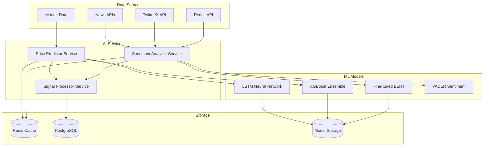

# Python AI Microservices - Technical Specifications

## Overview

The Python AI microservices provide advanced machine learning capabilities for price prediction and sentiment analysis, exposing RESTful APIs for integration with the C++ trading engine.

## Architecture



## 1. Price Predictor Service

### Service Structure
```
python/price_predictor/
├── app.py                    # Flask API server
├── models/
│   ├── __init__.py
│   ├── lstm_model.py         # LSTM implementation
│   ├── xgboost_model.py      # XGBoost implementation
│   ├── ensemble_model.py     # Model ensemble
│   └── model_trainer.py      # Training pipeline
├── data/
│   ├── __init__.py
│   ├── preprocessor.py       # Data preprocessing
│   ├── feature_engineer.py   # Feature engineering
│   └── data_loader.py        # Data loading utilities
├── api/
│   ├── __init__.py
│   ├── prediction_routes.py  # Prediction endpoints
│   └── training_routes.py    # Training endpoints
├── config/
│   ├── __init__.py
│   └── settings.py           # Configuration
├── tests/
│   ├── test_models.py
│   └── test_api.py
├── requirements.txt
└── Dockerfile
```

### Flask Application (app.py)
```python
from flask import Flask, request, jsonify
from flask_cors import CORS
import logging
import redis
import psycopg2
from models.lstm_model import LSTMPredictor
from models.xgboost_model import XGBoostPredictor
from models.ensemble_model import EnsemblePredictor
from data.preprocessor import DataPreprocessor
from config.settings import Config

app = Flask(__name__)
CORS(app)

# Initialize components
config = Config()
redis_client = redis.Redis(host=config.REDIS_HOST, port=config.REDIS_PORT)
preprocessor = DataPreprocessor(config)

# Initialize models
lstm_model = LSTMPredictor(config)
xgboost_model = XGBoostPredictor(config)
ensemble_model = EnsemblePredictor([lstm_model, xgboost_model], config)

@app.route('/health', methods=['GET'])
def health_check():
    return jsonify({'status': 'healthy', 'service': 'price_predictor'})

@app.route('/predict', methods=['POST'])
def predict_price():
    try:
        data = request.json
        symbol = data['symbol']
        timeframe = data.get('timeframe', '1m')
        horizon = data.get('horizon', 1)
        
        # Get historical data
        historical_data = get_historical_data(symbol, timeframe)
        
        # Preprocess data
        processed_data = preprocessor.process(historical_data)
        
        # Generate predictions
        lstm_pred = lstm_model.predict(processed_data, horizon)
        xgb_pred = xgboost_model.predict(processed_data, horizon)
        ensemble_pred = ensemble_model.predict(processed_data, horizon)
        
        # Cache results
        cache_key = f"prediction:{symbol}:{timeframe}:{horizon}"
        redis_client.setex(cache_key, 60, json.dumps({
            'lstm': lstm_pred.tolist(),
            'xgboost': xgb_pred.tolist(),
            'ensemble': ensemble_pred.tolist(),
            'timestamp': datetime.utcnow().isoformat()
        }))
        
        return jsonify({
            'symbol': symbol,
            'timeframe': timeframe,
            'horizon': horizon,
            'predictions': {
                'lstm': lstm_pred.tolist(),
                'xgboost': xgb_pred.tolist(),
                'ensemble': ensemble_pred.tolist()
            },
            'confidence': ensemble_model.get_confidence(),
            'timestamp': datetime.utcnow().isoformat()
        })
        
    except Exception as e:
        logging.error(f"Prediction error: {str(e)}")
        return jsonify({'error': str(e)}), 500

@app.route('/retrain', methods=['POST'])
def retrain_models():
    try:
        data = request.json
        symbol = data['symbol']
        
        # Trigger model retraining
        training_task = {
            'symbol': symbol,
            'timestamp': datetime.utcnow().isoformat(),
            'status': 'queued'
        }
        
        # Add to training queue
        redis_client.lpush('training_queue', json.dumps(training_task))
        
        return jsonify({
            'message': 'Retraining queued',
            'symbol': symbol,
            'task_id': str(uuid.uuid4())
        })
        
    except Exception as e:
        return jsonify({'error': str(e)}), 500

if __name__ == '__main__':
    app.run(host='0.0.0.0', port=5001, debug=config.DEBUG)
```

### LSTM Model Implementation
```python
import numpy as np
import tensorflow as tf
from tensorflow.keras.models import Sequential
from tensorflow.keras.layers import LSTM, Dense, Dropout, BatchNormalization
from tensorflow.keras.optimizers import Adam
from tensorflow.keras.callbacks import EarlyStopping, ReduceLROnPlateau
import joblib
from sklearn.preprocessing import MinMaxScaler

class LSTMPredictor:
    def __init__(self, config):
        self.config = config
        self.model = None
        self.scaler = MinMaxScaler()
        self.sequence_length = config.LSTM_SEQUENCE_LENGTH
        self.features = config.LSTM_FEATURES
        
    def build_model(self, input_shape):
        """Build LSTM model architecture"""
        model = Sequential([
            LSTM(128, return_sequences=True, input_shape=input_shape),
            Dropout(0.2),
            BatchNormalization(),
            
            LSTM(64, return_sequences=True),
            Dropout(0.2),
            BatchNormalization(),
            
            LSTM(32, return_sequences=False),
            Dropout(0.2),
            
            Dense(16, activation='relu'),
            Dropout(0.1),
            
            Dense(1, activation='linear')
        ])
        
        model.compile(
            optimizer=Adam(learning_rate=0.001),
            loss='mse',
            metrics=['mae']
        )
        
        return model
    
    def prepare_sequences(self, data):
        """Prepare sequences for LSTM training/prediction"""
        sequences = []
        targets = []
        
        for i in range(len(data) - self.sequence_length):
            seq = data[i:i + self.sequence_length]
            target = data[i + self.sequence_length]
            sequences.append(seq)
            targets.append(target)
            
        return np.array(sequences), np.array(targets)
    
    def train(self, training_data, validation_data=None):
        """Train the LSTM model"""
        # Scale the data
        scaled_data = self.scaler.fit_transform(training_data)
        
        # Prepare sequences
        X, y = self.prepare_sequences(scaled_data)
        
        # Build model
        self.model = self.build_model((self.sequence_length, len(self.features)))
        
        # Callbacks
        callbacks = [
            EarlyStopping(patience=10, restore_best_weights=True),
            ReduceLROnPlateau(factor=0.5, patience=5, min_lr=1e-7)
        ]
        
        # Train model
        history = self.model.fit(
            X, y,
            epochs=100,
            batch_size=32,
            validation_split=0.2 if validation_data is None else 0,
            callbacks=callbacks,
            verbose=1
        )
        
        return history
    
    def predict(self, data, horizon=1):
        """Generate price predictions"""
        if self.model is None:
            raise ValueError("Model not trained")
            
        # Scale input data
        scaled_data = self.scaler.transform(data)
        
        # Prepare sequence
        if len(scaled_data) < self.sequence_length:
            raise ValueError(f"Need at least {self.sequence_length} data points")
            
        sequence = scaled_data[-self.sequence_length:].reshape(1, self.sequence_length, -1)
        
        predictions = []
        current_sequence = sequence.copy()
        
        for _ in range(horizon):
            # Predict next value
            pred = self.model.predict(current_sequence, verbose=0)
            predictions.append(pred[0, 0])
            
            # Update sequence for next prediction
            new_row = np.zeros((1, 1, current_sequence.shape[2]))
            new_row[0, 0, 0] = pred[0, 0]  # Use prediction as next input
            current_sequence = np.concatenate([current_sequence[:, 1:, :], new_row], axis=1)
        
        # Inverse transform predictions
        predictions = np.array(predictions).reshape(-1, 1)
        dummy_features = np.zeros((len(predictions), len(self.features)))
        dummy_features[:, 0] = predictions.flatten()
        
        inverse_predictions = self.scaler.inverse_transform(dummy_features)[:, 0]
        
        return inverse_predictions
    
    def save_model(self, filepath):
        """Save model and scaler"""
        if self.model is not None:
            self.model.save(f"{filepath}_model.h5")
            joblib.dump(self.scaler, f"{filepath}_scaler.pkl")
    
    def load_model(self, filepath):
        """Load model and scaler"""
        self.model = tf.keras.models.load_model(f"{filepath}_model.h5")
        self.scaler = joblib.load(f"{filepath}_scaler.pkl")
```

### XGBoost Model Implementation
```python
import xgboost as xgb
import numpy as np
import pandas as pd
from sklearn.preprocessing import StandardScaler
from sklearn.model_selection import TimeSeriesSplit
import joblib

class XGBoostPredictor:
    def __init__(self, config):
        self.config = config
        self.model = None
        self.scaler = StandardScaler()
        self.feature_names = []
        
    def engineer_features(self, data):
        """Engineer features for XGBoost"""
        df = pd.DataFrame(data)
        
        # Technical indicators
        df['sma_5'] = df['close'].rolling(5).mean()
        df['sma_10'] = df['close'].rolling(10).mean()
        df['sma_20'] = df['close'].rolling(20).mean()
        
        df['ema_5'] = df['close'].ewm(span=5).mean()
        df['ema_10'] = df['close'].ewm(span=10).mean()
        df['ema_20'] = df['close'].ewm(span=20).mean()
        
        # RSI
        delta = df['close'].diff()
        gain = (delta.where(delta > 0, 0)).rolling(window=14).mean()
        loss = (-delta.where(delta < 0, 0)).rolling(window=14).mean()
        rs = gain / loss
        df['rsi'] = 100 - (100 / (1 + rs))
        
        # MACD
        exp1 = df['close'].ewm(span=12).mean()
        exp2 = df['close'].ewm(span=26).mean()
        df['macd'] = exp1 - exp2
        df['macd_signal'] = df['macd'].ewm(span=9).mean()
        df['macd_histogram'] = df['macd'] - df['macd_signal']
        
        # Bollinger Bands
        df['bb_middle'] = df['close'].rolling(20).mean()
        bb_std = df['close'].rolling(20).std()
        df['bb_upper'] = df['bb_middle'] + (bb_std * 2)
        df['bb_lower'] = df['bb_middle'] - (bb_std * 2)
        df['bb_width'] = df['bb_upper'] - df['bb_lower']
        df['bb_position'] = (df['close'] - df['bb_lower']) / df['bb_width']
        
        # ATR
        df['tr'] = np.maximum(
            df['high'] - df['low'],
            np.maximum(
                abs(df['high'] - df['close'].shift(1)),
                abs(df['low'] - df['close'].shift(1))
            )
        )
        df['atr'] = df['tr'].rolling(14).mean()
        
        # Price ratios
        df['high_low_ratio'] = df['high'] / df['low']
        df['close_open_ratio'] = df['close'] / df['open']
        
        # Lag features
        for lag in [1, 2, 3, 5, 10]:
            df[f'close_lag_{lag}'] = df['close'].shift(lag)
            df[f'volume_lag_{lag}'] = df['volume'].shift(lag)
        
        # Rolling statistics
        for window in [5, 10, 20]:
            df[f'close_std_{window}'] = df['close'].rolling(window).std()
            df[f'volume_mean_{window}'] = df['volume'].rolling(window).mean()
        
        # Time-based features
        df['hour'] = pd.to_datetime(df.index).hour
        df['day_of_week'] = pd.to_datetime(df.index).dayofweek
        df['month'] = pd.to_datetime(df.index).month
        
        # Drop original OHLCV columns and NaN values
        feature_cols = [col for col in df.columns if col not in ['open', 'high', 'low', 'close', 'volume']]
        df_features = df[feature_cols].dropna()
        
        self.feature_names = df_features.columns.tolist()
        return df_features.values
    
    def train(self, training_data, target_data):
        """Train XGBoost model"""
        # Engineer features
        X = self.engineer_features(training_data)
        y = target_data[len(training_data) - len(X):]  # Align with features after dropna
        
        # Scale features
        X_scaled = self.scaler.fit_transform(X)
        
        # Time series cross-validation
        tscv = TimeSeriesSplit(n_splits=5)
        
        # XGBoost parameters
        params = {
            'objective': 'reg:squarederror',
            'max_depth': 6,
            'learning_rate': 0.1,
            'n_estimators': 1000,
            'subsample': 0.8,
            'colsample_bytree': 0.8,
            'random_state': 42,
            'early_stopping_rounds': 50,
            'eval_metric': 'rmse'
        }
        
        # Train model with cross-validation
        best_score = float('inf')
        best_model = None
        
        for train_idx, val_idx in tscv.split(X_scaled):
            X_train, X_val = X_scaled[train_idx], X_scaled[val_idx]
            y_train, y_val = y[train_idx], y[val_idx]
            
            model = xgb.XGBRegressor(**params)
            model.fit(
                X_train, y_train,
                eval_set=[(X_val, y_val)],
                verbose=False
            )
            
            val_score = model.best_score
            if val_score < best_score:
                best_score = val_score
                best_model = model
        
        self.model = best_model
        return best_score
    
    def predict(self, data, horizon=1):
        """Generate predictions"""
        if self.model is None:
            raise ValueError("Model not trained")
        
        # Engineer features
        X = self.engineer_features(data)
        
        # Scale features
        X_scaled = self.scaler.transform(X)
        
        # Generate predictions
        predictions = []
        current_data = data.copy()
        
        for _ in range(horizon):
            # Get latest features
            latest_features = self.engineer_features(current_data)[-1:] 
            latest_scaled = self.scaler.transform(latest_features)
            
            # Predict
            pred = self.model.predict(latest_scaled)[0]
            predictions.append(pred)
            
            # Update data for next prediction (simplified)
            # In practice, you'd need to properly update OHLCV data
            current_data = np.vstack([current_data, [pred, pred, pred, pred, 0]])
        
        return np.array(predictions)
    
    def get_feature_importance(self):
        """Get feature importance"""
        if self.model is None:
            return None
            
        importance = self.model.feature_importances_
        return dict(zip(self.feature_names, importance))
    
    def save_model(self, filepath):
        """Save model and scaler"""
        if self.model is not None:
            self.model.save_model(f"{filepath}_model.json")
            joblib.dump(self.scaler, f"{filepath}_scaler.pkl")
            joblib.dump(self.feature_names, f"{filepath}_features.pkl")
    
    def load_model(self, filepath):
        """Load model and scaler"""
        self.model = xgb.XGBRegressor()
        self.model.load_model(f"{filepath}_model.json")
        self.scaler = joblib.load(f"{filepath}_scaler.pkl")
        self.feature_names = joblib.load(f"{filepath}_features.pkl")
```

## 2. Sentiment Analyzer Service

### Service Structure
```
python/sentiment_analyzer/
├── app.py                    # Flask API server
├── analyzers/
│   ├── __init__.py
│   ├── news_analyzer.py      # News sentiment analysis
│   ├── social_analyzer.py    # Social media sentiment
│   ├── bert_analyzer.py      # BERT-based analysis
│   └── vader_analyzer.py     # VADER sentiment
├── data_sources/
│   ├── __init__.py
│   ├── twitter_client.py     # Twitter/X API client
│   ├── news_client.py        # News API client
│   └── reddit_client.py      # Reddit API client
├── models/
│   ├── __init__.py
│   └── bert_model.py         # Fine-tuned BERT model
├── config/
│   ├── __init__.py
│   └── settings.py           # Configuration
├── requirements.txt
└── Dockerfile
```

### Flask Application (app.py)
```python
from flask import Flask, request, jsonify
from flask_cors import CORS
import logging
import redis
import json
from datetime import datetime, timedelta
from analyzers.news_analyzer import NewsAnalyzer
from analyzers.social_analyzer import SocialAnalyzer
from analyzers.bert_analyzer import BERTAnalyzer
from data_sources.twitter_client import TwitterClient
from data_sources.news_client import NewsClient
from config.settings import Config

app = Flask(__name__)
CORS(app)

# Initialize components
config = Config()
redis_client = redis.Redis(host=config.REDIS_HOST, port=config.REDIS_PORT)

# Initialize analyzers
news_analyzer = NewsAnalyzer(config)
social_analyzer = SocialAnalyzer(config)
bert_analyzer = BERTAnalyzer(config)

# Initialize data sources
twitter_client = TwitterClient(config)
news_client = NewsClient(config)

@app.route('/health', methods=['GET'])
def health_check():
    return jsonify({'status': 'healthy', 'service': 'sentiment_analyzer'})

@app.route('/analyze/news', methods=['POST'])
def analyze_news_sentiment():
    try:
        data = request.json
        symbol = data.get('symbol', 'FOREX')
        hours_back = data.get('hours_back', 24)
        
        # Get news articles
        articles = news_client.get_articles(symbol, hours_back)
        
        # Analyze sentiment
        sentiment_scores = []
        for article in articles:
            bert_score = bert_analyzer.analyze(article['content'])
            vader_score = news_analyzer.analyze_vader(article['content'])
            
            sentiment_scores.append({
                'title': article['title'],
                'source': article['source'],
                'timestamp': article['timestamp'],
                'bert_sentiment': bert_score,
                'vader_sentiment': vader_score,
                'combined_score': (bert_score + vader_score) / 2
            })
        
        # Calculate aggregate sentiment
        if sentiment_scores:
            avg_sentiment = sum(s['combined_score'] for s in sentiment_scores) / len(sentiment_scores)
            sentiment_trend = calculate_sentiment_trend(sentiment_scores)
        else:
            avg_sentiment = 0.0
            sentiment_trend = 'neutral'
        
        result = {
            'symbol': symbol,
            'timeframe': f'{hours_back}h',
            'aggregate_sentiment': avg_sentiment,
            'sentiment_trend': sentiment_trend,
            'article_count': len(sentiment_scores),
            'individual_scores': sentiment_scores,
            'timestamp': datetime.utcnow().isoformat()
        }
        
        # Cache results
        cache_key = f"news_sentiment:{symbol}:{hours_back}h"
        redis_client.setex(cache_key, 300, json.dumps(result))  # 5 min cache
        
        return jsonify(result)
        
    except Exception as e:
        logging.error(f"News sentiment analysis error: {str(e)}")
        return jsonify({'error': str(e)}), 500

@app.route('/analyze/social', methods=['POST'])
def analyze_social_sentiment():
    try:
        data = request.json
        symbol = data.get('symbol', 'FOREX')
        hours_back = data.get('hours_back', 24)
        
        # Get social media posts
        tweets = twitter_client.get_tweets(symbol, hours_back)
        
        # Analyze sentiment
        sentiment_scores = []
        for tweet in tweets:
            bert_score = bert_analyzer.analyze(tweet['text'])
            social_score = social_analyzer.analyze(tweet['text'])
            
            sentiment_scores.append({
                'text': tweet['text'][:100] + '...' if len(tweet['text']) > 100 else tweet['text'],
                'author': tweet['author'],
                'timestamp': tweet['timestamp'],
                'retweets': tweet['retweets'],
                'likes': tweet['likes'],
                'bert_sentiment': bert_score,
                'social_sentiment': social_score,
                'weighted_score': calculate_weighted_score(bert_score, social_score, tweet)
            })
        
        # Calculate aggregate sentiment with engagement weighting
        if sentiment_scores:
            total_weight = sum(s['retweets'] + s['likes'] + 1 for s in sentiment_scores)
            weighted_sentiment = sum(
                s['weighted_score'] * (s['retweets'] + s['likes'] + 1) 
                for s in sentiment_scores
            ) / total_weight
            
            sentiment_trend = calculate_sentiment_trend(sentiment_scores, 'weighted_score')
        else:
            weighted_sentiment = 0.0
            sentiment_trend = 'neutral'
        
        result = {
            'symbol': symbol,
            'timeframe': f'{hours_back}h',
            'aggregate_sentiment': weighted_sentiment,
            'sentiment_trend': sentiment_trend,
            'post_count': len(sentiment_scores),
            'individual_scores': sentiment_scores,
            'timestamp': datetime.utcnow().isoformat()
        }
        
        # Cache results
        cache_key = f"social_sentiment:{symbol}:{hours_back}h"
        redis_client.setex(cache_key, 300, json.dumps(result))
        
        return jsonify(result)
        
    except Exception as e:
        logging.error(f"Social sentiment analysis error: {str(e)}")
        return jsonify({'error': str(e)}), 500

@app.route('/analyze/combined', methods=['POST'])
def analyze_combined_sentiment():
    try:
        data = request.json
        symbol = data.get('symbol', 'FOREX')
        hours_back = data.get('hours_back', 24)
        
        # Get cached results or analyze fresh
        news_cache_key = f"news_sentiment:{symbol}:{hours_back}h"
        social_cache_key = f"social_sentiment:{symbol}:{hours_back}h"
        
        news_result = redis_client.get(news_cache_key)
        social_result = redis_client.get(social_cache_key)
        
        if news_result:
            news_sentiment = json.loads(news_result)['aggregate_sentiment']
        else:
            # Analyze news sentiment
            news_response = analyze_news_sentiment()
            news_sentiment = news_response.json['aggregate_sentiment']
        
        if social_result:
            social_sentiment = json.loads(social_result)['aggregate_sentiment']
        else:
            # Analyze social sentiment
            social_response = analyze_social_sentiment()
            social_sentiment = social_response.json['aggregate_sentiment']
        
        # Combine sentiments with weights
        news_weight = 0.6  # News typically more reliable
        social_weight = 0.4
        
        combined_sentiment = (news_sentiment * news_weight + 
                            social_sentiment * social_weight)
        
        # Determine overall trend
        if combined_sentiment > 0.1:
            trend = 'bullish'
        elif combined_sentiment < -0.1:
            trend = 'bearish'
        else:
            trend = 'neutral'
        
        result = {
            'symbol': symbol,
            'timeframe': f'{hours_back}h',
            'combined_sentiment': combined_sentiment,
            'news_sentiment': news_sentiment,
            'social_sentiment': social_sentiment,
            'overall_trend': trend,
            'confidence': abs(combined_sentiment),
            'timestamp': datetime.utcnow().isoformat()
        }
        
        return jsonify(result)
        
    except Exception as e:
        logging.error(f"Combined sentiment analysis error: {str(e)}")
        return jsonify({'error': str(e)}), 500

def calculate_sentiment_trend(scores, score_key='combined_score'):
    """Calculate sentiment trend over time"""
    if len(scores) < 2:
        return 'neutral'
    
    # Sort by timestamp
    sorted_scores = sorted(scores, key=lambda x: x['timestamp'])
    
    # Calculate trend
    recent_scores = [s[score_key] for s in sorted_scores[-10:]]  # Last 10 scores
    older_scores = [s[score_key] for s in sorted_scores[:-10]] if len(sorted_scores) > 10 else []
    
    if not older_scores:
        return 'neutral'
    
    recent_avg = sum(recent_scores) / len(recent_scores)
    older_avg = sum(older_scores) / len(older_scores)
    
    if recent_avg > older_avg + 0.1:
        return 'improving'
    elif recent_avg < older_avg - 0.1:
        return 'declining'
    else:
        return 'stable'

def calculate_weighted_score(bert_score, social_score, tweet):
    """Calculate weighted sentiment score based on engagement"""
    engagement = tweet['retweets'] + tweet['likes']
    base_score = (bert_score + social_score) / 2
    
    # Apply engagement weighting (logarithmic to prevent extreme outliers)
    engagement_factor = 1 + (np.log(engagement + 1) / 10)
    
    return base_score * engagement_factor

if __name__ == '__main__':
    app.run(host='0.0.0.0', port=5002, debug=config.DEBUG)
```

### BERT Analyzer Implementation
```python
import torch
from transformers import AutoTokenizer, AutoModelForSequenceClassification
import numpy as np
from typing import List, Dict

class BERTAnalyzer:
    def __init__(self, config):
        self.config = config
        self.device = torch.device('cuda' if torch.cuda.is_available() else 'cpu')
        
        # Load pre-trained FinBERT model for financial sentiment
        self.model_name = "ProsusAI/finbert"
        self.tokenizer = AutoTokenizer.from_pretrained(self.model_name)
        self.model = AutoModelForSequenceClassification.from_pretrained(self.model_name)
        self.model.to(self.device)
        self.model.eval()
        
        # Sentiment labels
        self.labels = ['negative', 'neutral', 'positive']
    
    def analyze(self, text: str) -> float:
        """Analyze sentiment of text using BERT"""
        try:
            # Tokenize input
            inputs = self.tokenizer(
                text,
                return_tensors="pt",
                truncation=True,
                padding=True,
                max_length=512
            ).to(self.device)
            
            # Get predictions
            with torch.no_grad():
                outputs = self.model(**inputs)
                predictions = torch.nn.functional.softmax(outputs.logits, dim=-1)
            
            # Convert to sentiment score (-1 to 1)
            scores = predictions.cpu().numpy()[0]
            sentiment_score = scores[2] - scores[0]  # positive - negative
            
            return float(sentiment_score)
            
        except Exception as e:
            print(f"BERT analysis error: {e}")
            return 0.0
    
    def analyze_batch(self, texts: List[str]) -> List[float]:
        """Analyze sentiment for multiple texts"""
        try:
            # Tokenize all texts
            inputs = self.tokenizer(
                texts,
                return_tensors="pt",
                truncation=True,
                padding=True,
                max_length=512
            ).to(self.device)
            
            # Get predictions
            with torch.no_gra