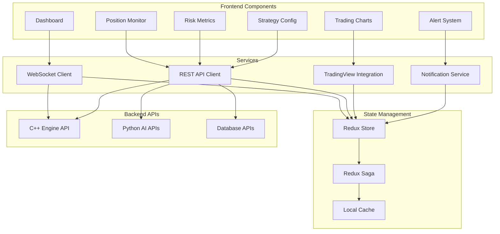

# React Dashboard - Technical Specifications

## Overview

The React dashboard provides a comprehensive real-time interface for monitoring trading activities, configuring strategies, and analyzing performance with professional-grade visualization components.

## Architecture



## Project Structure

```
frontend/
├── public/
│   ├── index.html
│   ├── favicon.ico
│   └── manifest.json
├── src/
│   ├── components/           # React components
│   │   ├── common/          # Shared components
│   │   │   ├── Header.jsx
│   │   │   ├── Sidebar.jsx
│   │   │   ├── LoadingSpinner.jsx
│   │   │   └── ErrorBoundary.jsx
│   │   ├── dashboard/       # Dashboard components
│   │   │   ├── Dashboard.jsx
│   │   │   ├── MetricsCard.jsx
│   │   │   ├── QuickStats.jsx
│   │   │   └── SystemStatus.jsx
│   │   ├── trading/         # Trading components
│   │   │   ├── TradingChart.jsx
│   │   │   ├── OrderBook.jsx
│   │   │   ├── TradeHistory.jsx
│   │   │   └── ManualTrading.jsx
│   │   ├── positions/       # Position components
│   │   │   ├── PositionTable.jsx
│   │   │   ├── PositionCard.jsx
│   │   │   └── PnLChart.jsx
│   │   ├── risk/           # Risk management
│   │   │   ├── RiskMetrics.jsx
│   │   │   ├── DrawdownChart.jsx
│   │   │   ├── ExposureChart.jsx
│   │   │   └── RiskLimits.jsx
│   │   ├── strategies/     # Strategy management
│   │   │   ├── StrategyConfig.jsx
│   │   │   ├── StrategyCard.jsx
│   │   │   ├── ParameterTuning.jsx
│   │   │   └── BacktestResults.jsx
│   │   ├── analytics/      # Analytics components
│   │   │   ├── PerformanceChart.jsx
│   │   │   ├── TradeAnalysis.jsx
│   │   │   ├── SentimentGauge.jsx
│   │   │   └── AIInsights.jsx
│   │   └── alerts/         # Alert system
│   │       ├── AlertPanel.jsx
│   │       ├── AlertCard.jsx
│   │       └── NotificationCenter.jsx
│   ├── services/           # API services
│   │   ├── websocket.js    # WebSocket client
│   │   ├── api.js          # REST API client
│   │   ├── tradingview.js  # TradingView integration
│   │   └── notifications.js # Notification service
│   ├── store/              # Redux store
│   │   ├── index.js        # Store configuration
│   │   ├── rootReducer.js  # Root reducer
│   │   ├── rootSaga.js     # Root saga
│   │   └── slices/         # Redux slices
│   │       ├── tradingSlice.js
│   │       ├── positionsSlice.js
│   │       ├── riskSlice.js
│   │       ├── strategiesSlice.js
│   │       └── alertsSlice.js
│   ├── utils/              # Utilities
│   │   ├── formatters.js   # Data formatters
│   │   ├── constants.js    # Constants
│   │   ├── calculations.js # Financial calculations
│   │   └── validators.js   # Form validators
│   ├── hooks/              # Custom hooks
│   │   ├── useWebSocket.js
│   │   ├── useRealTimeData.js
│   │   └── useLocalStorage.js
│   ├── styles/             # Styling
│   │   ├── globals.css
│   │   ├── components.css
│   │   └── themes.css
│   ├── App.jsx             # Main app component
│   └── index.js            # Entry point
├── package.json            # Dependencies
├── webpack.config.js       # Webpack configuration
├── .env                    # Environment variables
└── Dockerfile              # Docker configuration
```

## Core Components

### 1. Main Dashboard Component

```jsx
import React, { useEffect, useState } from 'react';
import { useSelector, useDispatch } from 'react-redux';
import { Grid, Paper, Typography, Box } from '@mui/material';
import { styled } from '@mui/material/styles';
import TradingChart from './trading/TradingChart';
import PositionTable from './positions/PositionTable';
import RiskMetrics from './risk/RiskMetrics';
import QuickStats from './dashboard/QuickStats';
import SystemStatus from './dashboard/SystemStatus';
import AlertPanel from './alerts/AlertPanel';
import { fetchDashboardData } from '../store/slices/tradingSlice';
import { useWebSocket } from '../hooks/useWebSocket';

const StyledPaper = styled(Paper)(({ theme }) => ({
  padding: theme.spacing(2),
  height: '100%',
  display: 'flex',
  flexDirection: 'column',
}));

const Dashboard = () => {
  const dispatch = useDispatch();
  const { 
    isConnected, 
    accountInfo, 
    positions, 
    orders,
    systemStatus 
  } = useSelector(state => state.trading);
  
  const [selectedSymbol, setSelectedSymbol] = useState('EUR/USD');
  
  // WebSocket connection for real-time updates
  const { lastMessage, connectionStatus } = useWebSocket('ws://localhost:8080/ws');
  
  useEffect(() => {
    // Initial data fetch
    dispatch(fetchDashboardData());
  }, [dispatch]);
  
  useEffect(() => {
    // Handle WebSocket messages
    if (lastMessage) {
      const data = JSON.parse(lastMessage.data);
      switch (data.type) {
        case 'tick':
          dispatch(updateTick(data.payload));
          break;
        case 'position_update':
          dispatch(updatePosition(data.payload));
          break;
        case 'order_update':
          dispatch(updateOrder(data.payload));
          break;
        case 'alert':
          dispatch(addAlert(data.payload));
          break;
        default:
          break;
      }
    }
  }, [lastMessage, dispatch]);
  
  return (
    <Box sx={{ flexGrow: 1, p: 3 }}>
      <Typography variant="h4" gutterBottom>
        Forex Scalping Bot Dashboard
      </Typography>
      
      <Grid container spacing={3}>
        {/* System Status */}
        <Grid item xs={12}>
          <StyledPaper>
            <SystemStatus 
              isConnected={isConnected}
              connectionStatus={connectionStatus}
              systemStatus={systemStatus}
            />
          </StyledPaper>
        </Grid>
        
        {/* Quick Stats */}
        <Grid item xs={12} md={8}>
          <StyledPaper>
            <QuickStats accountInfo={accountInfo} />
          </StyledPaper>
        </Grid>
        
        {/* Alerts */}
        <Grid item xs={12} md={4}>
          <StyledPaper>
            <AlertPanel />
          </StyledPaper>
        </Grid>
        
        {/* Trading Chart */}
        <Grid item xs={12} lg={8}>
          <StyledPaper sx={{ height: 600 }}>
            <TradingChart 
              symbol={selectedSymbol}
              onSymbolChange={setSelectedSymbol}
            />
          </StyledPaper>
        </Grid>
        
        {/* Risk Metrics */}
        <Grid item xs={12} lg={4}>
          <StyledPaper sx={{ height: 600 }}>
            <RiskMetrics />
          </StyledPaper>
        </Grid>
        
        {/* Positions */}
        <Grid item xs={12}>
          <StyledPaper>
            <PositionTable positions={positions} orders={orders} />
          </StyledPaper>
        </Grid>
      </Grid>
    </Box>
  );
};

export default Dashboard;
```

### 2. TradingView Chart Integration

```jsx
import React, { useEffect, useRef, useState } from 'react';
import { Box, FormControl, Select, MenuItem, Typography } from '@mui/material';
import { useSelector } from 'react-redux';

const TradingChart = ({ symbol, onSymbolChange }) => {
  const chartContainerRef = useRef();
  const widget = useRef();
  const { marketData, indicators } = useSelector(state => state.trading);
  
  const symbols = ['EUR/USD', 'GBP/USD', 'USD/JPY', 'AUD/USD', 'USD/CHF'];
  
  useEffect(() => {
    // Initialize TradingView widget
    if (chartContainerRef.current && !widget.current) {
      const script = document.createElement('script');
      script.src = 'https://s3.tradingview.com/tv.js';
      script.async = true;
      script.onload = () => {
        widget.current = new window.TradingView.widget({
          autosize: true,
          symbol: `FX:${symbol.replace('/', '')}`,
          interval: '1',
          container_id: chartContainerRef.current.id,
          datafeed: createDatafeed(),
          library_path: '/charting_library/',
          locale: 'en',
          disabled_features: [
            'use_localstorage_for_settings',
            'volume_force_overlay',
          ],
          enabled_features: [
            'study_templates',
            'side_toolbar_in_fullscreen_mode',
          ],
          charts_storage_url: 'https://saveload.tradingview.com',
          charts_storage_api_version: '1.1',
          client_id: 'tradingview.com',
          user_id: 'public_user_id',
          fullscreen: false,
          autosize: true,
          studies_overrides: {},
          theme: 'dark',
          custom_css_url: '/trading_chart.css',
          loading_screen: { backgroundColor: '#1a1a1a' },
          overrides: {
            'paneProperties.background': '#1a1a1a',
            'paneProperties.vertGridProperties.color': '#363c4e',
            'paneProperties.horzGridProperties.color': '#363c4e',
            'symbolWatermarkProperties.transparency': 90,
            'scalesProperties.textColor': '#AAA',
          },
        });
      };
      document.head.appendChild(script);
    }
    
    return () => {
      if (widget.current) {
        widget.current.remove();
        widget.current = null;
      }
    };
  }, []);
  
  useEffect(() => {
    // Update chart symbol
    if (widget.current && symbol) {
      widget.current.chart().setSymbol(`FX:${symbol.replace('/', '')}`);
    }
  }, [symbol]);
  
  const createDatafeed = () => {
    return {
      onReady: (callback) => {
        setTimeout(() => callback({
          supported_resolutions: ['1', '5', '15', '30', '60', '240', '1D'],
          supports_marks: false,
          supports_timescale_marks: false,
        }), 0);
      },
      
      searchSymbols: (userInput, exchange, symbolType, onResultReadyCallback) => {
        const results = symbols
          .filter(s => s.toLowerCase().includes(userInput.toLowerCase()))
          .map(s => ({
            symbol: s,
            full_name: s,
            description: s,
            exchange: 'FX',
            ticker: s.replace('/', ''),
            type: 'forex',
          }));
        onResultReadyCallback(results);
      },
      
      resolveSymbol: (symbolName, onSymbolResolvedCallback, onResolveErrorCallback) => {
        const symbolInfo = {
          ticker: symbolName,
          name: symbolName,
          description: symbolName,
          type: 'forex',
          session: '24x7',
          timezone: 'Etc/UTC',
          exchange: 'FX',
          minmov: 1,
          pricescale: 100000,
          has_intraday: true,
          intraday_multipliers: ['1', '5', '15', '30', '60'],
          supported_resolutions: ['1', '5', '15', '30', '60', '240', '1D'],
          volume_precision: 2,
          data_status: 'streaming',
        };
        setTimeout(() => onSymbolResolvedCallback(symbolInfo), 0);
      },
      
      getBars: (symbolInfo, resolution, from, to, onHistoryCallback, onErrorCallback, firstDataRequest) => {
        // Fetch historical data from backend
        fetch(`/api/historical-data?symbol=${symbolInfo.ticker}&resolution=${resolution}&from=${from}&to=${to}`)
          .then(response => response.json())
          .then(data => {
            const bars = data.map(bar => ({
              time: bar.timestamp * 1000,
              low: bar.low,
              high: bar.high,
              open: bar.open,
              close: bar.close,
              volume: bar.volume,
            }));
            onHistoryCallback(bars, { noData: bars.length === 0 });
          })
          .catch(error => {
            console.error('Error fetching historical data:', error);
            onErrorCallback(error);
          });
      },
      
      subscribeBars: (symbolInfo, resolution, onRealtimeCallback, subscribeUID, onResetCacheNeededCallback) => {
        // Subscribe to real-time updates via WebSocket
        // This would be handled by the WebSocket connection in the parent component
      },
      
      unsubscribeBars: (subscribeUID) => {
        // Unsubscribe from real-time updates
      },
    };
  };
  
  return (
    <Box sx={{ height: '100%', display: 'flex', flexDirection: 'column' }}>
      <Box sx={{ display: 'flex', justifyContent: 'space-between', alignItems: 'center', mb: 2 }}>
        <Typography variant="h6">Trading Chart</Typography>
        <FormControl size="small" sx={{ minWidth: 120 }}>
          <Select
            value={symbol}
            onChange={(e) => onSymbolChange(e.target.value)}
          >
            {symbols.map(s => (
              <MenuItem key={s} value={s}>{s}</MenuItem>
            ))}
          </Select>
        </FormControl>
      </Box>
      <Box
        ref={chartContainerRef}
        id="tradingview_chart"
        sx={{ flexGrow: 1, minHeight: 400 }}
      />
    </Box>
  );
};

export default TradingChart;
```

### 3. Position Table Component

```jsx
import React, { useState } from 'react';
import {
  Table,
  TableBody,
  TableCell,
  TableContainer,
  TableHead,
  TableRow,
  Paper,
  Chip,
  IconButton,
  Typography,
  Box,
  Tabs,
  Tab,
  Button,
} from '@mui/material';
import { Close as CloseIcon, Edit as EditIcon } from '@mui/icons-material';
import { useDispatch } from 'react-redux';
import { closePosition, cancelOrder } from '../store/slices/tradingSlice';
import { formatCurrency, formatPercentage } from '../utils/formatters';

const PositionTable = ({ positions, orders }) => {
  const dispatch = useDispatch();
  const [tabValue, setTabValue] = useState(0);
  
  const handleClosePosition = (positionId) => {
    dispatch(closePosition(positionId));
  };
  
  const handleCancelOrder = (orderId) => {
    dispatch(cancelOrder(orderId));
  };
  
  const getPositionColor = (pnl) => {
    if (pnl > 0) return 'success';
    if (pnl < 0) return 'error';
    return 'default';
  };
  
  const getOrderStatusColor = (status) => {
    switch (status) {
      case 'filled': return 'success';
      case 'pending': return 'warning';
      case 'cancelled': return 'error';
      default: return 'default';
    }
  };
  
  const PositionsTab = () => (
    <TableContainer component={Paper}>
      <Table>
        <TableHead>
          <TableRow>
            <TableCell>Symbol</TableCell>
            <TableCell>Side</TableCell>
            <TableCell align="right">Size</TableCell>
            <TableCell align="right">Entry Price</TableCell>
            <TableCell align="right">Current Price</TableCell>
            <TableCell align="right">Unrealized P&L</TableCell>
            <TableCell align="right">Return %</TableCell>
            <TableCell>Strategy</TableCell>
            <TableCell>Duration</TableCell>
            <TableCell align="center">Actions</TableCell>
          </TableRow>
        </TableHead>
        <TableBody>
          {positions.map((position) => (
            <TableRow key={position.id}>
              <TableCell>
                <Typography variant="body2" fontWeight="bold">
                  {position.symbol}
                </Typography>
              </TableCell>
              <TableCell>
                <Chip
                  label={position.side}
                  color={position.side === 'BUY' ? 'success' : 'error'}
                  size="small"
                />
              </TableCell>
              <TableCell align="right">
                {formatCurrency(position.size)}
              </TableCell>
              <TableCell align="right">
                {position.entryPrice.toFixed(5)}
              </TableCell>
              <TableCell align="right">
                {position.currentPrice.toFixed(5)}
              </TableCell>
              <TableCell align="right">
                <Typography
                  color={getPositionColor(position.unrealizedPnl)}
                  fontWeight="bold"
                >
                  {formatCurrency(position.unrealizedPnl)}
                </Typography>
              </TableCell>
              <TableCell align="right">
                <Typography
                  color={getPositionColor(position.returnPercentage)}
                  fontWeight="bold"
                >
                  {formatPercentage(position.returnPercentage)}
                </Typography>
              </TableCell>
              <TableCell>
                <Chip
                  label={position.strategy}
                  variant="outlined"
                  size="small"
                />
              </TableCell>
              <TableCell>
                {formatDuration(position.duration)}
              </TableCell>
              <TableCell align="center">
                <IconButton
                  size="small"
                  onClick={() => handleClosePosition(position.id)}
                  color="error"
                >
                  <CloseIcon />
                </IconButton>
              </TableCell>
            </TableRow>
          ))}
          {positions.length === 0 && (
            <TableRow>
              <TableCell colSpan={10} align="center">
                <Typography variant="body2" color="textSecondary">
                  No open positions
                </Typography>
              </TableCell>
            </TableRow>
          )}
        </TableBody>
      </Table>
    </TableContainer>
  );
  
  const OrdersTab = () => (
    <TableContainer component={Paper}>
      <Table>
        <TableHead>
          <TableRow>
            <TableCell>Symbol</TableCell>
            <TableCell>Type</TableCell>
            <TableCell>Side</TableCell>
            <TableCell align="right">Size</TableCell>
            <TableCell align="right">Price</TableCell>
            <TableCell align="right">Stop Loss</TableCell>
            <TableCell align="right">Take Profit</TableCell>
            <TableCell>Status</TableCell>
            <TableCell>Strategy</TableCell>
            <TableCell>Created</TableCell>
            <TableCell align="center">Actions</TableCell>
          </TableRow>
        </TableHead>
        <TableBody>
          {orders.map((order) => (
            <TableRow key={order.id}>
              <TableCell>
                <Typography variant="body2" fontWeight="bold">
                  {order.symbol}
                </Typography>
              </TableCell>
              <TableCell>
                <Chip
                  label={order.type}
                  variant="outlined"
                  size="small"
                />
              </TableCell>
              <TableCell>
                <Chip
                  label={order.side}
                  color={order.side === 'BUY' ? 'success' : 'error'}
                  size="small"
                />
              </TableCell>
              <TableCell align="right">
                {formatCurrency(order.size)}
              </TableCell>
              <TableCell align="right">
                {order.price ? order.price.toFixed(5) : 'Market'}
              </TableCell>
              <TableCell align="right">
                {order.stopLoss ? order.stopLoss.toFixed(5) : '-'}
              </TableCell>
              <TableCell align="right">
                {order.takeProfit ? order.takeProfit.toFixed(5) : '-'}
              </TableCell>
              <TableCell>
                <Chip
                  label={order.status}
                  color={getOrderStatusColor(order.status)}
                  size="small"
                />
              </TableCell>
              <TableCell>
                <Chip
                  label={order.strategy}
                  variant="outlined"
                  size="small"
                />
              </TableCell>
              <TableCell>
                {formatDateTime(order.createdAt)}
              </TableCell>
              <TableCell align="center">
                {order.status === 'pending' && (
                  <IconButton
                    size="small"
                    onClick={() => handleCancelOrder(order.id)}
                    color="error"
                  >
                    <CloseIcon />
                  </IconButton>
                )}
              </TableCell>
            </TableRow>
          ))}
          {orders.length === 0 && (
            <TableRow>
              <TableCell colSpan={11} align="center">
                <Typography variant="body2" color="textSecondary">
                  No orders
                </Typography>
              </TableCell>
            </TableRow>
          )}
        </TableBody>
      </Table>
    </TableContainer>
  );
  
  return (
    <Box>
      <Box sx={{ display: 'flex', justifyContent: 'space-between', alignItems: 'center', mb: 2 }}>
        <Typography variant="h6">Positions & Orders</Typography>
        <Button variant="outlined" size="small">
          Close All Positions
        </Button>
      </Box>
      
      <Tabs value={tabValue} onChange={(e, newValue) => setTabValue(newValue)}>
        <Tab label={`Positions (${positions.length})`} />
        <Tab label={`Orders (${orders.length})`} />
      </Tabs>
      
      <Box sx={{ mt: 2 }}>
        {tabValue === 0 && <PositionsTab />}
        {tabValue === 1 && <OrdersTab />}
      </Box>
    </Box>
  );
};

// Helper functions
const formatDuration = (milliseconds) => {
  const seconds = Math.floor(milliseconds / 1000);
  const minutes = Math.floor(seconds / 60);
  const hours = Math.floor(minutes / 60);
  
  if (hours > 0) return `${hours}h ${minutes % 60}m`;
  if (minutes > 0) return `${minutes}m ${seconds % 60}s`;
  return `${seconds}s`;
};

const formatDateTime = (timestamp) => {
  return new Date(timestamp).toLocaleString();
};

export default PositionTable;
```

### 4. Risk Metrics Component

```jsx
import React from 'react';
import {
  Box,
  Typography,
  Grid,
  Card,
  CardContent,
  LinearProgress,
  Chip,
} from '@mui/material';
import {
  TrendingUp,
  TrendingDown,
  Warning,
  CheckCircle,
} from '@mui/icons-material';
import { useSelector } from 'react-redux';
import { formatCurrency, formatPercentage } from '../utils/formatters';

const RiskMetrics = () => {
  const { riskMetrics, accountInfo } = useSelector(state => state.trading);
  
  const getRiskColor = (value, threshold) => {
    if (value > threshold * 0.8) return 'error';
    if (value > threshold * 0.6) return 'warning';
    return 'success';
  };
  
  const getRiskIcon = (value, threshold) => {
    if (value > threshold * 0.8) return <Warning color="error" />;
    if (value > threshold * 0.6) return <TrendingUp color="warning" />;
    return <CheckCircle color="success" />;
  };
  
  const MetricCard = ({ title, value, threshold, format = 'currency', icon }) => (
    <Card>
      <CardContent>
        <Box sx={{ display: 'flex', alignItems: 'center', mb: 1 }}>
          {icon}
          <Typography variant="h6" sx={{ ml: 1 }}>
            {title}
          </Typography>
        </Box>
        <Typography variant="h4" color={getRiskColor(value, threshold)}>
          {format === 'currency' ? formatCurrency(value) : formatPercentage(value)}
        </Typography>
        <Box sx={{ mt: 1 }}>
          <LinearProgress
            variant="determinate"
            value={(value / threshold) * 100}
            color={getRiskColor(value, threshold)}
          />
          <Typography variant="caption" color="textSecondary">
            Limit: {format === 'currency' ? formatCurrency(threshold) : formatPercentage(threshold)}
          </Typography>
        </Box>
      </CardContent>
    </Card>
  );
  
  return (
    <Box>
      <Typography variant="h6" gutterBottom>
        Risk Management
      </Typography>
      
      <Grid container spacing={2}>
        <Grid item xs={12}>
          <MetricCard
            title="Daily Drawdown"
            value={Math.abs(riskMetrics.dailyDrawdown)}
            threshold={riskMetrics.maxDailyDrawdown}
            format="percentage"
            icon={getRiskIcon(Math.abs(riskMetrics.dailyDrawdown), riskMetrics.maxDailyDrawdown)}
          />
        </Grid>
        
        <Grid item xs={12}>
          <MetricCard
            title="Position Exposure"
            value={riskMetrics.totalExposure}
            threshold={accountInfo.balance * 0.1} // 10% max exposure
            format="currency"
            icon={getRiskIcon(riskMetrics.totalExposure, accountInfo.balance * 0.1)}
          />
        </Grid>
        
        <Grid item xs={12}>
          <Card>
            <CardContent>
              <Typography variant="h6" gutterBottom>
                Correlation Risk
              </Typography>
              {riskMetrics.correlations.map((corr, index) => (
                <Box key={index} sx={{ mb: 1 }}>
                  <Box sx={{ display: 'flex', justifyContent: 'space-between', alignItems: 'center' }}>
                    <Typography variant="body2">
                      {corr.pair1} / {corr.pair2}
                    </Typography>
                    <Chip
                      label={formatPercentage(corr.correlation)}
                      color={Math.abs(corr.correlation) > 0.7 ? 'error' : 'default'}
                      size="small"
                    />
                  </Box>
                  <LinearProgress
                    variant="determinate"
                    value={Math.abs(corr.correlation) * 100}
                    color={Math.abs(corr.correlation) > 0.7 ? 'error' : 'primary'}
                  />
                </Box>
              ))}
            </CardContent>
          </Card>
        </Grid>
        
        <Grid item xs={12}>
          <Card>
            <CardContent>
              <Typography variant="h6" gutterBottom>
                Risk Summary
              </Typography>
              <Grid container spacing={1}>
                <Grid item xs={6}>
                  <Typography variant="body2" color="textSecondary">
                    Risk Score
                  </Typography>
                  <Typography variant="h6" color={getRiskColor(riskMetrics.riskScore, 100)}>
                    {riskMetrics.riskScore}/100
                  </Typography>
                </Grid>
                <Grid item xs={6}>
                  <Typography variant="body2" color="textSecondary">
                    Kelly Fraction
                  </Typography>
                  <Typography variant="h6">
                    {formatPercentage(riskMetrics.kellyFraction)}
                  </Typography>
                </Grid>
                <Grid item xs={6}>
                  <Typography variant="body2" color="textSecondary">
                    Sharpe Ratio
                  </Typography>
                  <Typography variant="h6">
                    {riskMetrics.sharpeRatio.toFixed(2)}
                  </Typography>
                </Grid>
                <Grid item xs={6}>
                  <Typography variant="body2" color="textSecondary">
                    Max Drawdown
                  </Typography>
                  <Typography variant="h6" color="error">
                    {formatPercentage(riskMetrics.maxDrawdown)}
                  </Typography>
                </Grid>
              </Grid>
            </CardContent>
          </Card>
        </Grid>
      </Grid>
    </Box>
  );
};

export default RiskMetrics;
```

## WebSocket Integration

### WebSocket Hook

```jsx
import { use